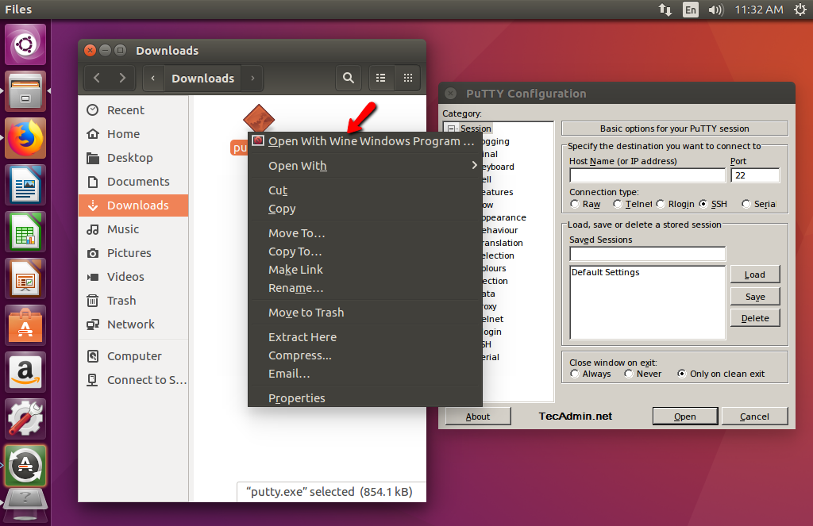

# Welcome fablab assuit

# Index

- vynil 
- laser cutter

fablab assuit is very nice

- git add
- git commit-m"nnn"
- git push

- my name is saad
- This first one for me
- my live is nice

- 123456789
- saoda
- nona

[I'm an inline-style link](https://www.google.com)

## Lists
1. Menus
2. Labels
3. Tabs
4. Files
5. Men

Emphasis, aka italics, with *asterisks* or _underscores_.

Strong emphasis, aka bold, with **asterisks** or __underscores__.

Combined emphasis with **asterisks and _underscores_**.

Strikethrough uses two tildes. ~~Scratch this.~~

:EMOJICODE:.

@octocat :+1: This PR looks great - it's ready to merge! :shipit:

# STEM
